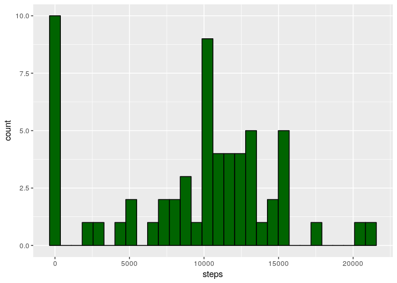
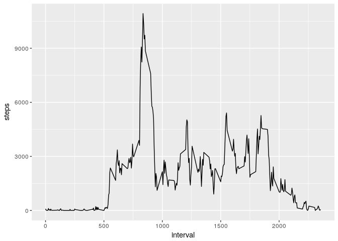
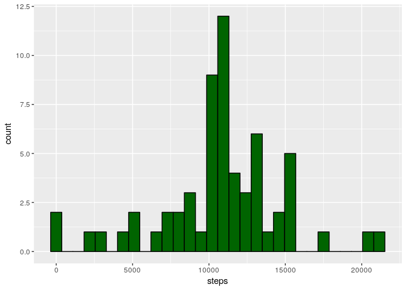
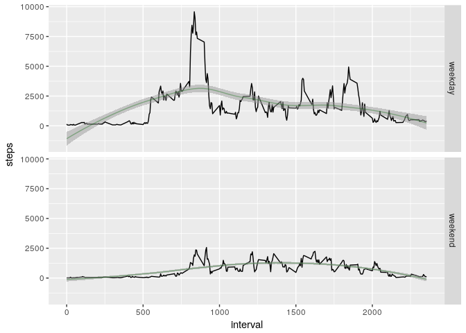

# Reproducible Research: Peer Assessment 1

The following analysis relates to fitbit step data.


```r
libs <- c("knitr", "ggplot2", "dplyr", "lubridate")
invisible(sapply(libs, require, character.only = TRUE))
knitr::opts_chunk$set(echo=TRUE, fig.path='figure/')
```

## Loading and preprocessing the data

The file is unzipped and read using `read.csv`.
Data tidying is completed using `dplyr`.


```r
if (!file.exists('activity.csv'))
  unzip('activity.zip')

df <-
  read.csv('activity.csv', stringsAsFactors = FALSE) %>%
  mutate(
    date = ymd(date, tz="EST"),
    datetime = date + (interval * 60)
  )
```

## What is mean total number of steps taken per day?

The daily step count histogram is generally mound shaped with several outliers at zero.


```r
df_day <- df %>%
  group_by(date) %>%
  summarize(steps=sum(steps, na.rm =TRUE)) %>%
  filter(!is.na(steps))

ggplot(df_day, aes(steps)) +
  geom_histogram(fill="darkgreen", color="black", bins=30)
```

<!-- -->

The mean and median daily steps are computed as below.

```r
mean(df_day$steps)
```

```
## [1] 9354.23
```

```r
median(df_day$steps)
```

```
## [1] 10395
```

## What is the average daily activity pattern?

The daily pattern is shown in the time series plot below.


```r
df_int <- df %>%
  group_by(interval) %>%
  summarize(steps=sum(steps, na.rm = TRUE))

ggplot(df_int, aes(x=interval, y=steps)) +
    geom_line()
```

<!-- -->

The maximum value can be found as follows.

```r
df_int[which.max(df_int$steps), "interval"]
```

```
## # A tibble: 1 x 1
##   interval
##      <int>
## 1      835
```

## Imputing missing values

There are 2304 missing values in the data.

```r
sum(is.na(df$steps))
```

```
## [1] 2304
```

The handle these, assume a missing value is equal to the average value of non-NA values with the same hour-of-day across the entire dataset.


```r
# Create lookup data frame of hourly means
df_hrs <- df %>% group_by(hour = hour(datetime)) %>%
  summarize(steps=ceiling(mean(steps, na.rm=TRUE)))

# Override the NAs using the lookup data
df_imputed <- df %>%
  mutate(hour = hour(datetime)) %>%
  left_join(df_hrs, by = "hour") %>%
  mutate(steps = ifelse(is.na(steps.x), steps.y, steps.x))

# Aggregate to daily values
df_imputed_day <- df_imputed %>%
  group_by(date) %>%
  summarize(steps=sum(steps))

ggplot(df_imputed_day, aes(steps)) +
  geom_histogram(fill="darkgreen", color="black", bins=30)
```

<!-- -->

The new mean and median are:

```r
mean(df_imputed_day$steps)
```

```
## [1] 10780.59
```

```r
median(df_imputed_day$steps)
```

```
## [1] 10876
```

## Are there differences in activity patterns between weekdays and weekends?

To examine the differences between weekdays and weekends, ggplot faceting can be invoked using a factor variable containing the weekend vs. weekday classification of the data.
The dataset with the NA values already imputed will be used.


```r
df_imputed_int <- df_imputed %>%
  mutate(weekday = as.factor(
    ifelse(!weekdays(df$date) %in% c("Saturday", "Sunday"), "weekday", "weekend"))) %>%
  group_by(interval, weekday) %>%
  summarize(steps=sum(steps))

ggplot(df_imputed_int, aes(x=interval, y=steps)) +
  geom_line() +
  geom_smooth(alpha=0.5, size=0, method='loess') + 
  geom_line(stat="smooth", method="loess", color="darkgreen", alpha=0.35) +
  facet_grid(weekday ~ .)
```

<!-- -->

From the data, we can see that weekend mornings are more relaxing than weekday mornings, which, based on my domain expertise, provides confidence that the analysis is correct.
